# 词法分析

## 1 正则表达式

### 基本概念

- 正则表达式是一种用来描述*正则语言*的*更紧凑*的表示方法。
- 正则表达式可以由较小的正则表达式按照特定规则*递归*地构建。每个正则表达式 r 定义（表示）一个语言，记为 $L(r)$。这个语言也是根据 r 的子表达式所表示的语言递归定义的。

### 定义

- $\epsilon$ （空串）是一个 RE（正则表达式），则 $L(\epsilon)=\{\epsilon\}$（空串的正则表达式所包含的语言就只有空串）

- 如果 $\alpha \in\Sigma$，则 $\alpha$ 是一个 RE，$L(\alpha)=\{\alpha\}$

- 假设 r 和 s 都是 RE，表示的语言分别是 L(r) 和 L(s)，则

  r|s 是一个 RE，$L(r|s)=L(r)\cup L(s)$

  rs 是一个 RE，$L(rs)=L(r)L(s)$

  $r^{*}$ 是一个 RE, $L\left(r^{*}\right)=(L(r))^{n}$
  
  (r) 是一个 RE，$L((r))=L(r)$
  
  运算优先级：*、连接、|（由高到低）

### 例

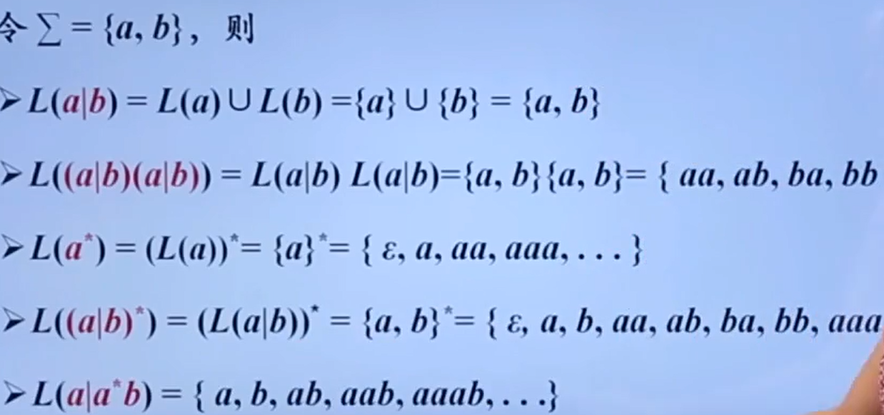

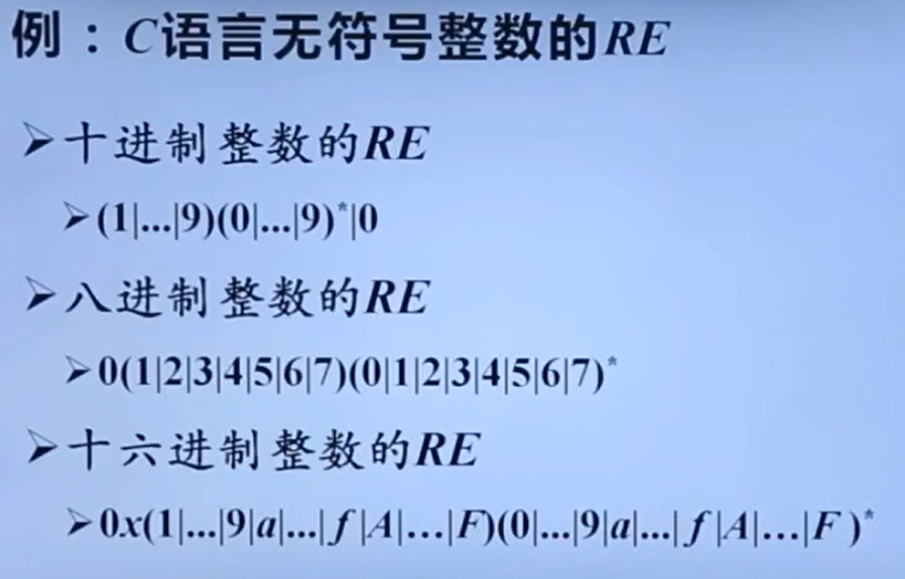

### 正则语言

可以用正则表达式（RE）定义的语言叫做**正则语言**或**正则集合**

### 正则表达式的代数定律

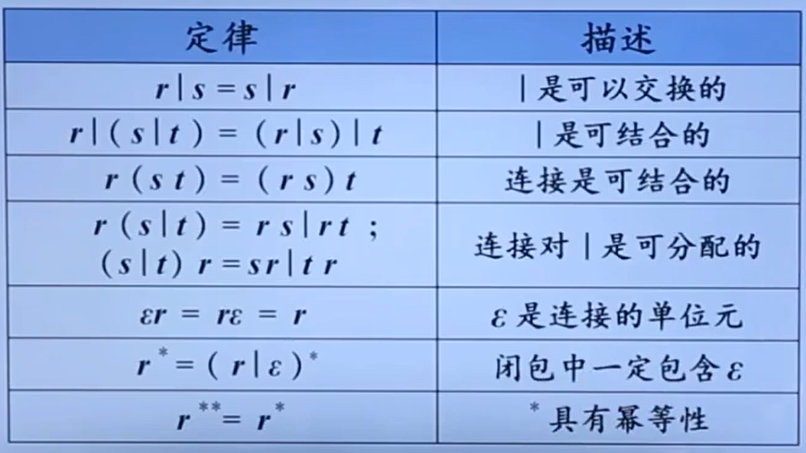

### 正则文法与正则表达式等价

对于任何正则表达式 G，存在定义同一语言的正则表达式 r

对任何正则表达式 r，存在生成同一语言的正则文法 G

## 2. 正则定义

正则定义是具有如下形式的定义序列：
$$
d_1\rightarrow r_1\\
d_2\rightarrow r_2\\
...\\
d_n\rightarrow r_n
$$
其中：每个 di 都是一个*新符号*，它们都不在字母表 $\Sigma$ 中，而且各不相同

​          每个 ri 是字母表 $\Sigma \cup\{d_1,d_2,...,d_{i-1}\}$ 上的正则表达式 

即：正则定义是给一些 RE 命名，并在之后的 RE 中像使用字母表中的符号一样使用这些名字

例：

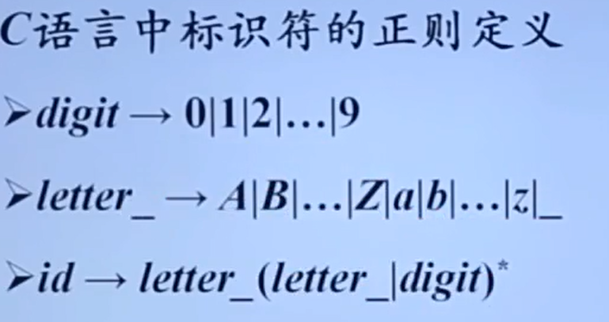 

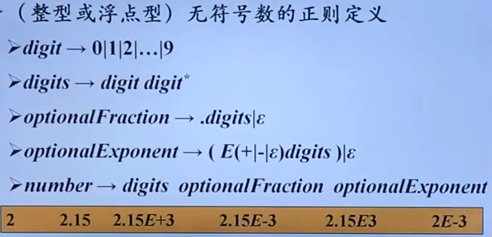 

## 3. 有穷自动机

### 基本概念

- 有穷自动机（FA）是对*一类处理系统*建立的数学模型
- 这类系统具有一系列*离散的输入输出信息*和*有穷数目的内部状态*（状态：概括了对过去输入信息处理的状况）
- 系统只需要根据*当前所处的状态*和*当前面临的输入信息*就可以决定系统的*后继行为*。每当系统处理了当前的输入后，系统的*内部状态也将发生改变*

### 模型

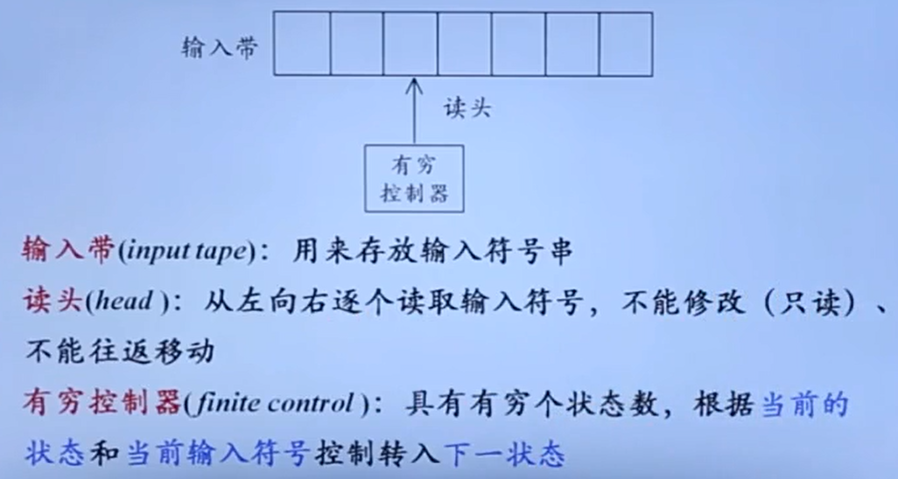

### 表示

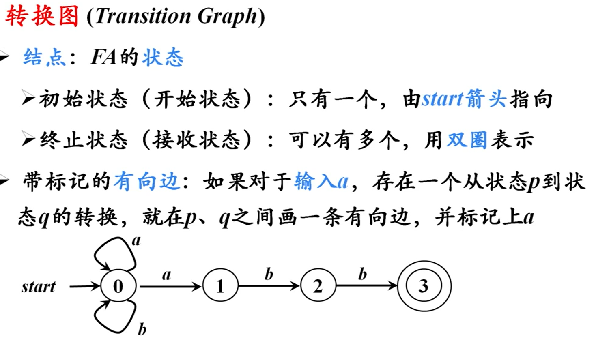

### 有穷自动机定义（接受）的语言

- 给定输入串 x，如果存在一个对应于串 x 的从*初始状态*到*某个终止状态*的转换序列，则称串 x 被该 FA *接收*
- 由一个有穷自动机 M 接受的所有串构成的集合称为是*该 FA 定义（或接受）的语言*，记为 *L(M)*

例如：

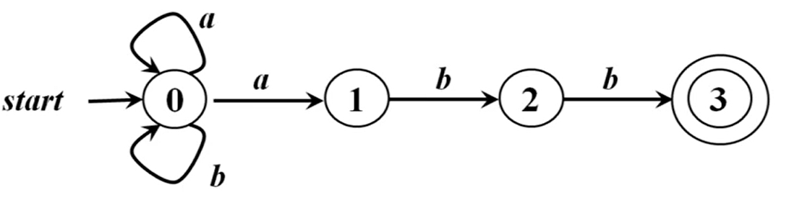

1. abbaabb就能被上图的有穷自动机接受
2. L(M) = 所有以 abb 结尾的字母表{a, b} 上的串的集合

### 最长子串匹配原则

- 当输入串的*多个前缀*与一个或多个模式匹配时，总是选择*最长的前缀*进行匹配

  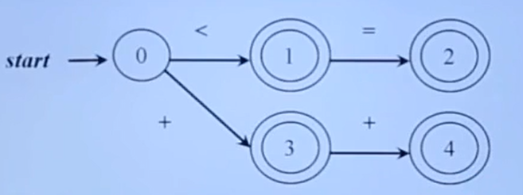 

- 在到达某个终态之后，只要输入带上还带有符号，FA 就继续前进，以便寻找尽可能长的匹配

## 4. 有穷自动机的分类

1. 确定的有穷自动机（DFA）
2. 非确定的有穷自动机（NFA）

### DFA

$$
M=\left(S, \Sigma, \delta, s_{0}, F\right)
$$

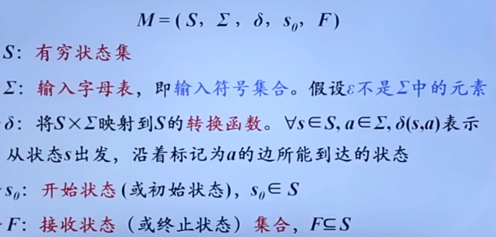

例：

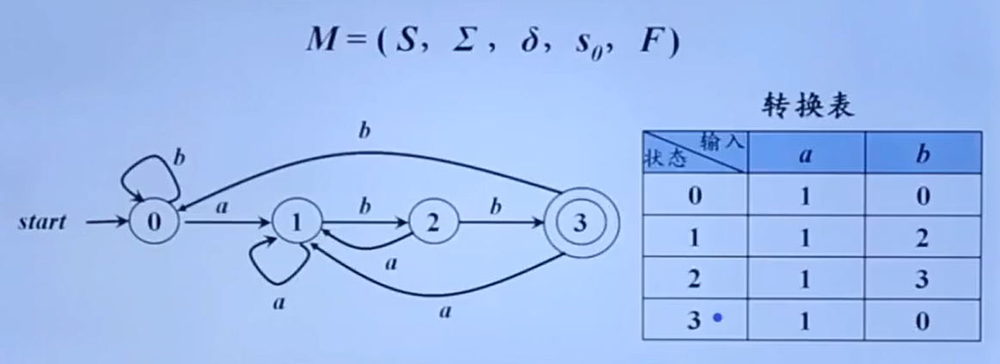

如上图所示，也可以用*转换表*表示 DFA

### NFA

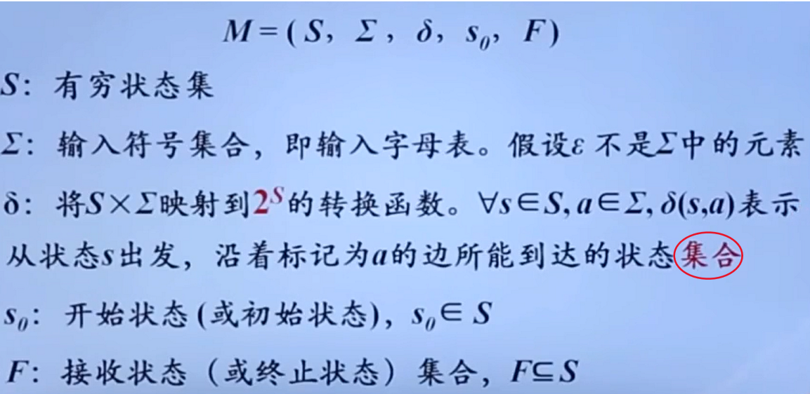

NFA 与 DFA 的区别就是，NFA 的 $\delta$ 所能到达的状态是非确定的

例：

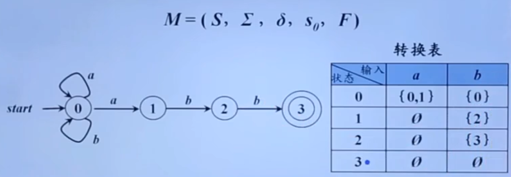

（如果转换函数没有给出对应于某个*状态-输入*对的信息，就把 $\empty$ 放入对应的表项中

### DFA 和 NFA 的等价性

- 对于任何 NFA *N*，存在识别同一语言的 DFA *D*
- 对于任何 DFA *D*，存在识别同一语言的 NFA *N*

例：

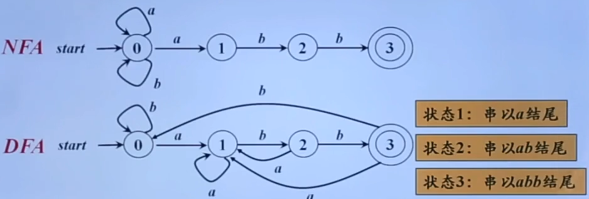

- 两个有穷自动机接受的都是以 abb 结尾的串，所以两个有穷自动机*等价*
- 当然，这两个有穷自动机也可以表示为*正则表达式*：$(a|b)^*abb$ 
- 正则表达式、正则文法、有穷自动机，三者都是*等价*
- 如上图所示，一般来说，NFA 要比 DFA *直观*，但是从计算机实现上来说， DFA 要比 NFA 更容易实现

### 带有“$\epsilon$ - 边”的 NFA

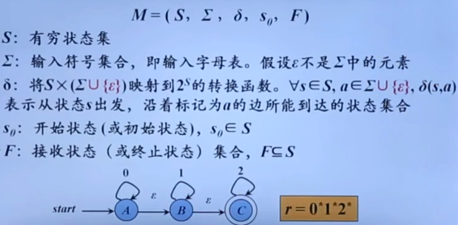

上图实际上就是：若干个 0 连接上若干个 1 再连接上若干个 2 的串

### 带有和不带有“$\epsilon$ - 边”的 NFA 的等价性 

例：

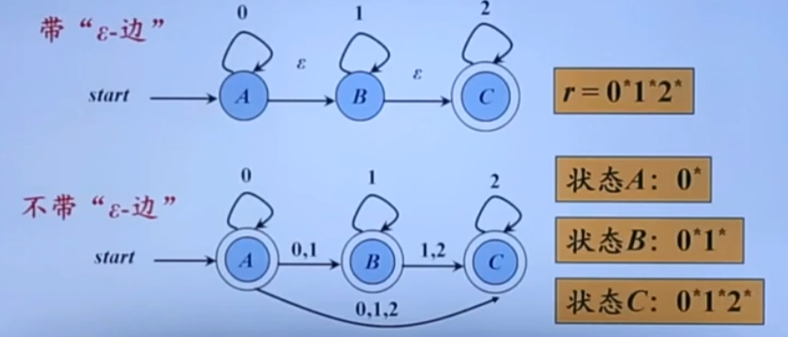

### DFA 的算法实现

输入：以文件结尾符 eof 结尾的字符串 x。DAF *D* 的开始状态 $s_0$，接受状态集 F，转换函数 move

输出：如果 D 接受 x，则回答“yes”，否则回答“no”

方法：将下述算法应用于输入串 x

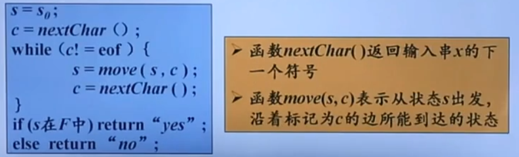

## 5. 从正则表达式到有穷自动机

### 根据 RE 构造 NFA

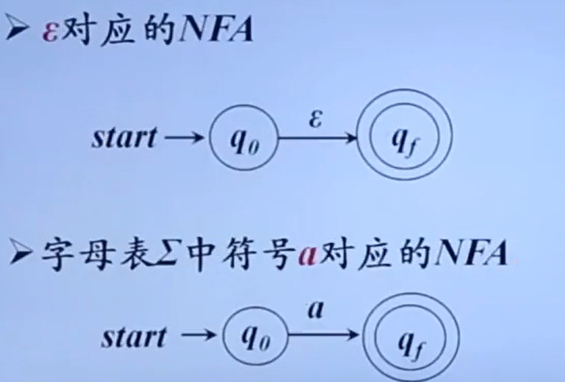

如果 $r_1$ $r_2$ 都是正则表达式，则 r 的示意图如下：

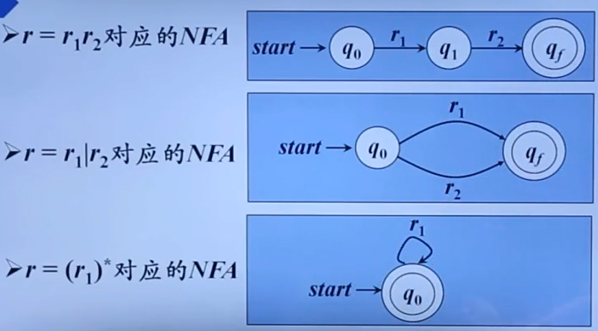

例：

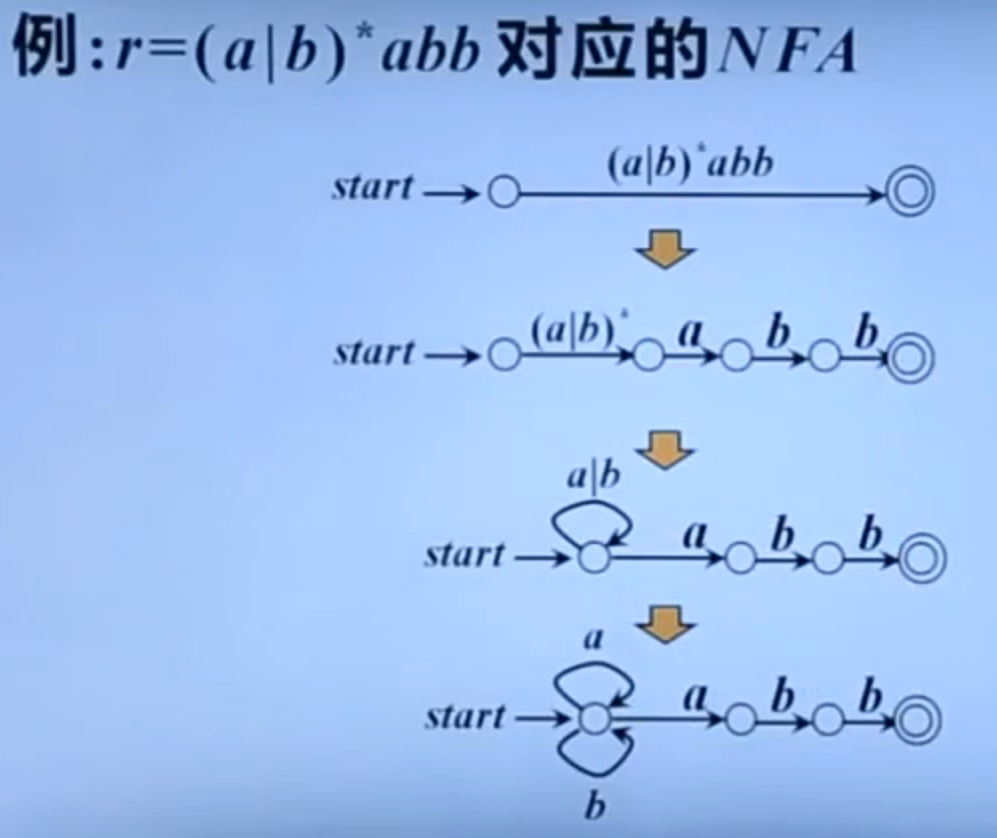

## 6. 从 NFA 到 DFA 的转换

例一：

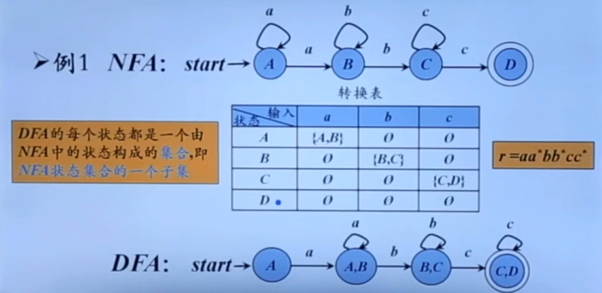

例二：从带有 $\epsilon $- 边的 NFA 到 DFA 的转换

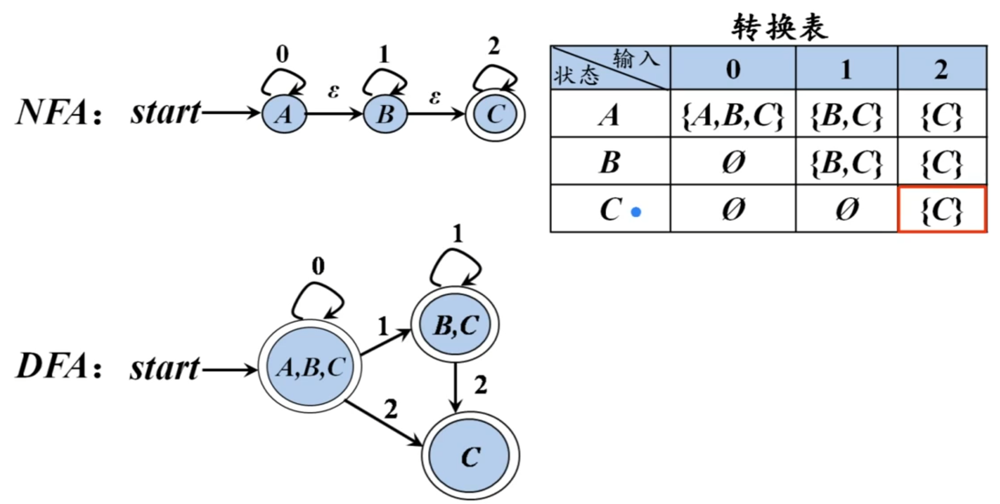

### 子集构造法（从 NFA 到 DFA）

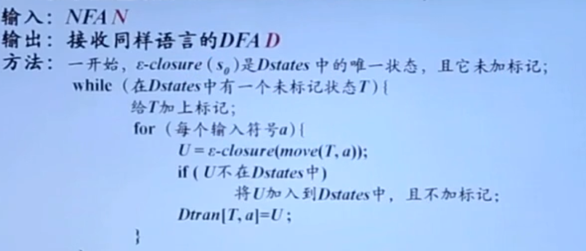

## 7. 识别单词的 DFA

### 识别标识符的 DFA

1. 先根据表达式画出 NFA

2. 再根据 NFA 画出 DFA（DFA 接收到一个符号后的状态是确定的）

### 识别各进制无符号整数的 DFA

左侧三个为*分别*识别三种进制的 DFA，右侧是识别各进制无符号整数的 DFA

### 识别注释的 DFA

