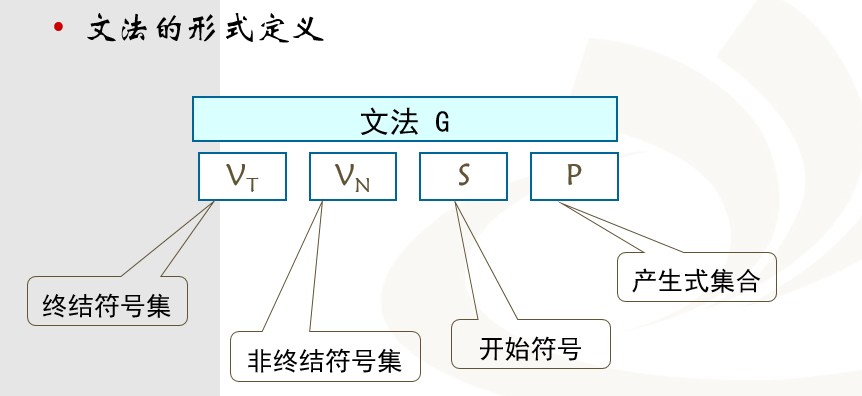
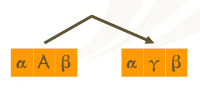

# 第二章 形式文法与形式语言

## 语言概述

### 符号串和语言

#### 字母表

**字母表**是符号的**非空有穷集合**，记为 **$\Sigma$**

- 符号是一个抽象实体，表示可以互相区分的记号或元素
- 字母表 $\Sigma=\{a, b, c\}$，表示由 a,b,c 三个符号组成
- 不同的语言有不同的字母表：汉语——汉字、数字、标点符号；英语——二十六个英文字母
- 字母表中至少包含一个元素，可以是任何符号

#### 符号串

**符号串**是由字母表中的符号所组成的**有穷序列**，又称为**句子**

- 例如：$\Sigma=\{a, b, c\}$，则 a,b,aa,ab,aabba....都是 $\Sigma$ 上的符号串
- 符号串总是建立在某个特定字母表上，且只由字母表上的有穷多个符号组成
- 符号串中符号的顺序是很重要的
- **空符号串**：不包含任何符号的符号串，记为ε，是任何 Σ 上的符号串

#### 符号串的运算

- 连接：符号串的$\alpha$、$\beta$ 的连接，是把 $\beta$ 的符号写在 $\alpha$ 的符号之后得到的符号串 $\alpha\beta$ 
- 方幂：符号串 $\alpha$ 自身连接 n 次得到的符号串 $\alpha$$\alpha$...$\alpha$$\alpha$ (n 个 $\alpha$) 表示为$\alpha$n，α0=ε

#### 语言的非形式定义

- 字母表 ∑ 上的一个语言是 ∑ 上的符号串的集合，即语言定义为**字母表上的符号串集合**
- 空集Φ={ }是一个语言，{ε}也是一个语言；ε是符号串, 不是集合，而{ε}表示由空符号串ε所组成的集合, 但这样的集合不是空集合Φ={ } 

#### 语言的运算

##### 并运算

并运算：语言 L 和 M 的合并，记为 L∪M，定义为：$\mathrm{L} \cup \mathrm{M}=\{\mathrm{s} \mid \mathrm{s} \in \mathrm{L} \text { 或者 } \mathrm{s} \in \mathrm{M}\}$

##### 连接

连接：语言L和M的连接，记为 LM，定义为：$\mathrm{LM}=\{\mathrm{st} \mid \mathrm{s} \in \mathrm{L}$ 且 $\mathrm{t} \in \mathrm{M}\}$

例如：集合 A ={ab, cde}、 B ={0,1}，则 AB = { ab1,ab0,cde0,cde1 }；L0 = {ε}

##### 正闭包  L+

$\mathbf{L}^{+}=\mathbf{L}^{1} \cup \mathbf{L}^{2} \cup \ldots \cup \mathbf{L}^{n} \ldots$

##### Kleane闭包  L*

$\mathbf{L}^{*}=\mathbf{L}^{0} \cup \mathbf{L}^{1} \cup \mathbf{L}^{2} \cup \ldots \cup \mathbf{L}^{n} \ldots=\{\varepsilon\} \cup \mathbf{L}^{+}$

- 通常考虑字母表 $\Sigma$ 的 * 闭包和 + 闭包
- 字母表∑的正闭包表示字母表中元素a, b构成的所有符号串的集合,集合A的*闭包比集合A的正闭包多含一个空符号串$\varepsilon$

### 文法和语言

#### 文法的形式定义

##### 符号集	

- 终结符号集 VT ：代表语言中不可再分的基本符号，如a,b,c,0,1,2
- 非终结符号集 VN ：代表语法单位，如语句、表达式、子程序（如主语、谓语、宾语）
- VT  ∩ VN = ∅
- 开始符号 S ：是一个特殊的非终结符号，代表最高级的语法单位，S 至少要在一条产生式中作为左部出现

##### 产生式集合

- **产生式**（重写规则、生成式），是形如 **α→β** 或 α∷=β 的（α，β）有序对，且α∈V+，β∈V*，其中 V=（VT∪VN）
- α 称为产生式的左部，不能为空 ε，且至少有一个VN中的元素出现
- β 称为产生式的右部，可以为空 ε
- 如：A → ε 

##### 例一

- 文法 G = （VT，VN，S，P）
- VT ={ 0, 1 }
- VN = { S }
- P = { S→0S1, S→01 }

可以只写出产生式，通过产生式可以得到文法的其它部分，并把文法记为G[S]，其中 S 为开始符号

简写：左部相同的产生式可以写在一起，如: S →0S1 | 01

##### 例二

- 文法 G = （VT，VN，S，P）
- VT = { a , b , c , … x , y , z , 0 , 1 , … , 9 }
- ]
- 
- VN = {<标识符>，<字母>，<数字>}
- P = { <标识符>→<字母>     <标识符>→<标识符><字母>     <标识符>→<标识符><数字>     <字母>→a,…, <字母>→z     <数字>→0,…, <数字>→9  }
- S = <标识符>

#### 推导与归约

推导是用产生式的右部代替左部，归约是用产生式的左部代替右部，归约是推导的<u>逆过程</u>

##### 直接推导

 如果 A → γ 是 G 的一条产生式，则称用 αγβ 代替 αAβ 为一步直接推导，记为 $a A \beta \Rightarrow aγ\beta$ 

	

##### 直接规约

用 αAβ 代替 αγβ 为一步直接归约，记为 $a γ \beta \Leftarrow aA\beta$ 