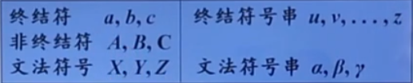
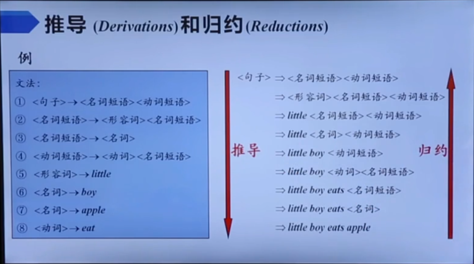
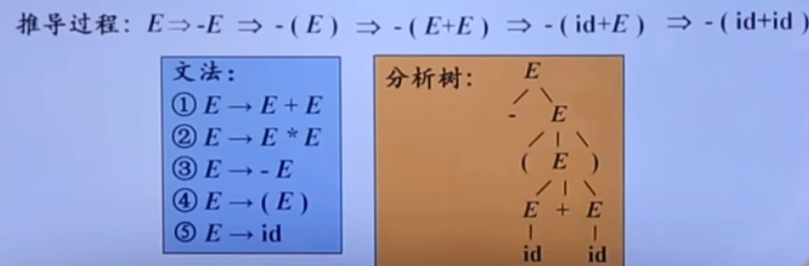

# 第二章 形式文法与形式语言

## 语言概述

### 符号串和语言

#### 字母表

**字母表**是符号的**非空有穷集合**，记为 **$\Sigma$**

- 符号是一个抽象实体，表示可以互相区分的记号或元素
- 字母表 $\Sigma=\{a, b, c\}$，表示由 a,b,c 三个符号组成
- 不同的语言有不同的字母表：汉语——汉字、数字、标点符号；英语——二十六个英文字母
- 字母表中至少包含一个元素，可以是任何符号

#### 符号串

**符号串**是由字母表中的符号所组成的**有穷序列**，又称为**句子**

- 例如：$\Sigma=\{a, b, c\}$，则 a,b,aa,ab,aabba....都是 $\Sigma$ 上的符号串
- 符号串总是建立在某个特定字母表上，且只由字母表上的有穷多个符号组成
- 符号串中符号的顺序是很重要的
- **空符号串**：不包含任何符号的符号串，记为ε，是任何 Σ 上的符号串

#### 符号串的运算

- 连接：符号串的$\alpha$、$\beta$ 的连接，是把 $\beta$ 的符号写在 $\alpha$ 的符号之后得到的符号串 $\alpha\beta$ 
- 方幂：符号串 $\alpha$ 自身连接 n 次得到的符号串 $\alpha$$\alpha$...$\alpha$$\alpha$ (n 个 $\alpha$) 表示为$\alpha$n，α0=ε

#### 语言的非形式定义

- 字母表 ∑ 上的一个语言是 ∑ 上的符号串的集合，即语言定义为**字母表上的符号串集合**
- 空集Φ={ }是一个语言，{ε}也是一个语言；ε是符号串, 不是集合，而{ε}表示由空符号串ε所组成的集合, 但这样的集合不是空集合Φ={ } 

#### 语言的运算

##### 并运算

并运算：语言 L 和 M 的合并，记为 L∪M，定义为：$\mathrm{L} \cup \mathrm{M}=\{\mathrm{s} \mid \mathrm{s} \in \mathrm{L} \text { 或者 } \mathrm{s} \in \mathrm{M}\}$

##### 连接

连接：语言L和M的连接，记为 LM，定义为：$\mathrm{LM}=\{\mathrm{st} \mid \mathrm{s} \in \mathrm{L}$ 且 $\mathrm{t} \in \mathrm{M}\}$

例如：集合 A ={ab, cde}、 B ={0,1}，则 AB = { ab1,ab0,cde0,cde1 }；L0 = {ε}

##### 正闭包  L+

$\mathbf{L}^{+}=\mathbf{L}^{1} \cup \mathbf{L}^{2} \cup \ldots \cup \mathbf{L}^{n} \ldots$

##### Kleane闭包  L*

$\mathbf{L}^{*}=\mathbf{L}^{0} \cup \mathbf{L}^{1} \cup \mathbf{L}^{2} \cup \ldots \cup \mathbf{L}^{n} \ldots=\{\varepsilon\} \cup \mathbf{L}^{+}$

- 通常考虑字母表 $\Sigma$ 的 * 闭包和 + 闭包
- 字母表∑的正闭包表示字母表中元素a, b构成的所有符号串的集合,集合A的*闭包比集合A的正闭包多含一个空符号串$\varepsilon$

### 文法和语言

#### 自然语言的例子

- <句子> $\rightarrow$ <名词短语><动词短语>
- <名词短语> $\rightarrow$ <形容词><名词短语>
- <名词短语> $\rightarrow$ <名词>
- <动词短语> $\rightarrow$ <动词><名词短语>
- <形容词> $\rightarrow$ little
- <名词> $\rightarrow$ boy
- <名词> $\rightarrow$ apple
- <动词> $\rightarrow$ eat

#### 文法的形式定义

- 文法 G = （VT，VN，S，P）
- VT：**终结符**号集，代表语言中不可再分的基本符号，如 little，boy，apple，eat
- VN：**非终结符**号集，代表语法单位，如<句子>、<名词短语>、<名词>
- $V_{T} \cap V_{N}=\boldsymbol{\Phi}$，$V_{T} \cup V_{N}$：文法集符号
- P：产生式集合
- S：开始符号，表示的是该文法中最大的语法成分
- 约定：在不引起歧义的前提下，可以只写产生式

##### 产生式

- 描述了将终结符和非终结符组合成串的方法，形如 **α→β** 
- α∈V+，β∈V*，其中 V=（VT∪VN）
- α 称为产生式的左部，不能为空 ε，且至少有一个VN中的元素出现
- β 称为产生式的右部，可以为空 ε
- 如：A → ε 
##### 产生式的简写

对于一组有相同左部的产生式

​		$\alpha \rightarrow \beta_{1}, \alpha \rightarrow \beta_{2}, \ldots, \alpha \rightarrow \beta_{n}$

可以简写为

​		$\alpha \rightarrow \beta_{1}\left|\beta_{2}\right| \ldots \mid \beta_{n}$

##### 符号约定

	

#### 推导与归约

推导是用产生式的右部代替左部，归约是用产生式的左部代替右部，归约是推导的<u>逆过程</u>

##### 直接推导

 如果 A → γ 是 G 的一条产生式，则称用 αγβ 代替 αAβ 为一步直接推导，记为 $a A \beta \Rightarrow aγ\beta$ 

	

##### 直接规约

用 αAβ 代替 αγβ 为一步直接归约，记为 $a γ \beta \Leftarrow aA\beta$ 

##### 例一

#### 文法的分类

从 0 型文法到 3 型文法逐级包含，其中 0 型文法的限制最少

##### 0 型文法

- 也称**无限制文法**/短语结构文法
- ==$\forall \alpha \rightarrow \beta \in P$，$\alpha$ 中至少包含一个非终结符==
- 由 0 型文法 G 生成的语言 L(G) 称为 0 型语言

##### 1 型文法

- 也称**上下文有关文法**（CSG）
- ==$\forall \alpha \rightarrow \beta \in P, \quad|\alpha| \leq|\beta|$==
- 产生式的一般形式为：$\alpha_{1} A \alpha_{2} \rightarrow \alpha_{1} \beta \alpha_{2}(\beta \neq \varepsilon)$ （即非终结符 A，只有在上下文都分别为 $\alpha_{1}$ 和 $\alpha_{1}$ 的时候，$A$ 才能替换为 $\beta$ 
- 该文法中不包括  $\varepsilon-$ 产生式（空产生式） 

##### 2 型文法

- 也称**上下文无关文法**（CFG）
- ==$\forall \alpha \rightarrow \beta \in P, \alpha \in V_{N}$ （即左部为非终结符）==
- 产生式的一般形式为 $A \rightarrow \beta$（即将 $A$ 替换为 $\beta$ 不需要上下文）

##### 3 型文法（正则文法）

- 也称**正则文法**（RG）
- ==$\alpha \rightarrow \beta$==
- 分为**右线性文法**：==$A \rightarrow w B$或 $A \rightarrow w$== 和**左线性文法**：==$A \rightarrow Bw$ 或 $A \rightarrow w$==
- 正则文法能描述程序设计语言的多数单词

#### 分析树

- 一颗分析树对应一个特定的句型
- **根节点**的标号为**文法开始符号**
- **内部节点** 表示对一个产生式 $A\rightarrow\beta$ 的应用，该**节点的标号**是此产生式的左部$A$；该结点的**子节点的标号**，从左到右构成了**产生式的右部** $\beta$ 
- 分析树是推导的图形化表示，对于推导过程中得到的每一个句型 $\alpha_{i}$，都可以构造出一个边缘为 $\alpha_{i}$ 的分析树

##### 例子

1. 假定第三条产生式为开始语句
2. 依次推导，得到一颗分析树
3. 该分析树的边缘就是推导得到的句子：-(id + id)

#### （句型）的短语

- 给定一个句型，其分析树中的每一颗**子树的边缘**称为该句型的一个**短语**
- 如果子树只有父子两代节点（即以该节点为根节点的子树高度为2），那么这颗子树的边缘称为该句型的一个**直接短语**
- 直接短语**一定**是某产生式的右部
- 但是产生式的右部**不一定**是给定句型的直接短语
- **句柄**是最左直接短语
##### 素短语

- 它是个短语，并且至少含有一个终结符，并且，除它自身之外不再含任何更小的素短语
- 所谓最左素短语就是处于句型最左边的素短语

#### 二义性文法

- 如果一个文法可以为某个句子生成多颗分析树，则称这个文法是**二义性**的

###### 判定

- 对于任意一个上下文无关文法，不存在一个算法，判定它是无二义性的
- 但是能给出一组**充分条件**，满足这组充分条件的文法是无二义性的