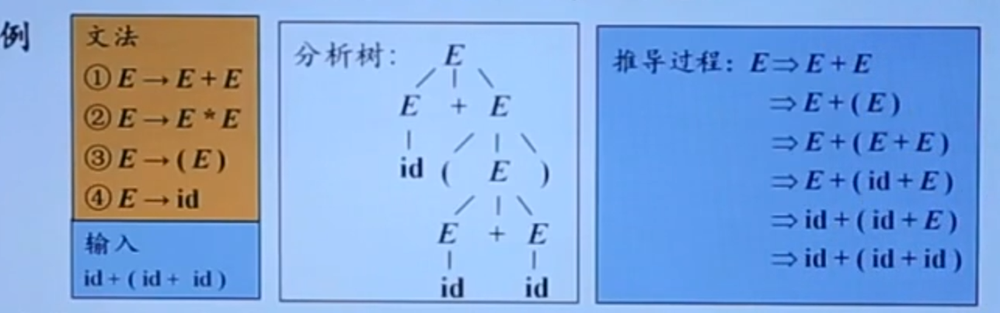
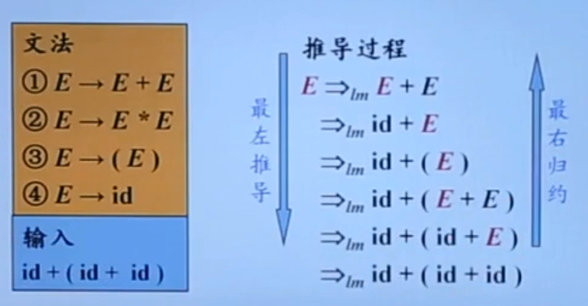
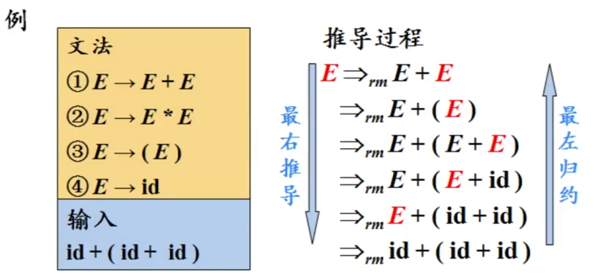
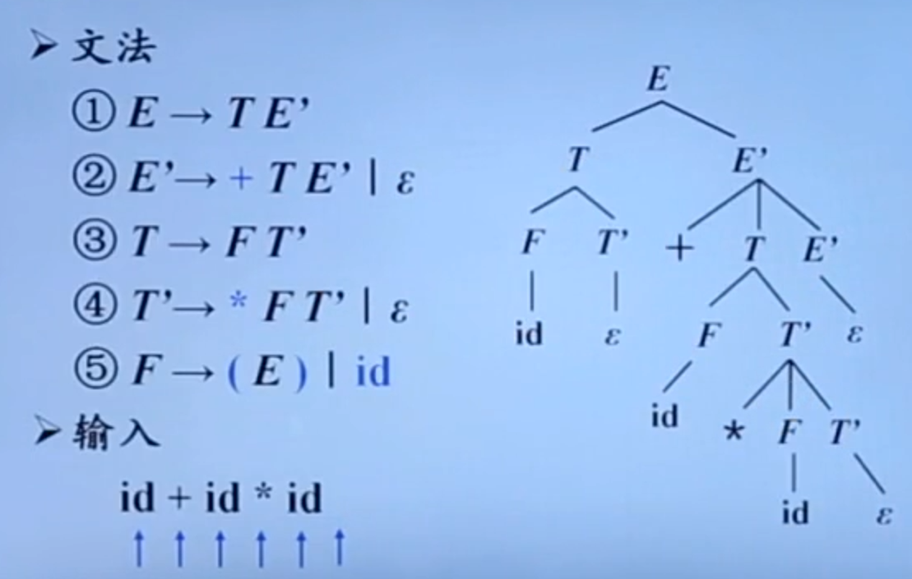

# 自顶向下分析概述

## 自顶向下的分析

从分析树的顶部（根节点）向底部（叶节点）方向构造分析树

可以看成是从文法开始符号 S 推导出词串 w 的过程

每一步推导中，都需要做两个选择：

1. 替换当前句型中的哪个非终结符
2. 用该非终结符的哪个候选式进行替换

<u>自顶向下的语法采用最左推导的方式</u>：

- 总是选择每个句型的*最左非终结符*进行替换
- 根据输入流的*下一个终结符*，选择最左非终结符的一个候选式

### 最左推导

在最左推导中，总是选择每个句型的**最左非终结符**进行替换

例：

最左推导是最右规约的逆过程

从文法用最左推导得到的句型称为当前文法的**最左句型**

### 最右推导

在最右推导中，总是选择每个句型的最右非终结符进行替换

在自底向上的分析中，总是采用最左归约的方式，因此把**最左归约**称为**规范规约**，而**最右推导**相应地称为**规范推导**

### 例子

## 自顶向下语法分析的通用形式

### 递归下降分析

由一组过程组成，每个过程对应一个非终结符

从文法开始符号 S 对应的过程开始，其中**递归调用**文法中其它非终结符对应的过程。如果 S 对应的过程体恰好扫描了整个输入串，则成功完成语法分析

可能需要**回溯**，导致效率较低

### 预测分析

预测分析是递归下降分析技术的一个特例，通过在输入中**向前看固定个数**（通常为 1）符号来选择正确的 A - 产生式

可以对某些文法构造出向前看 k 个输入符号的预测分析器，该类文法有时也称为 **LL(K) 文法类**

预测分析<u>不需要回溯</u>，是一种**确定**的自顶向下分析方法

