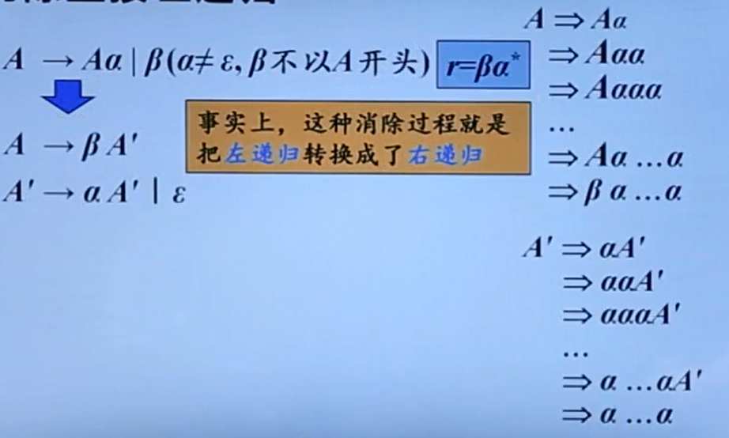
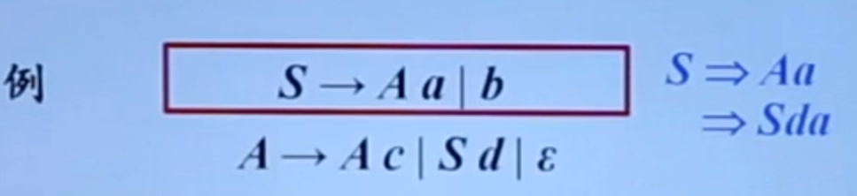
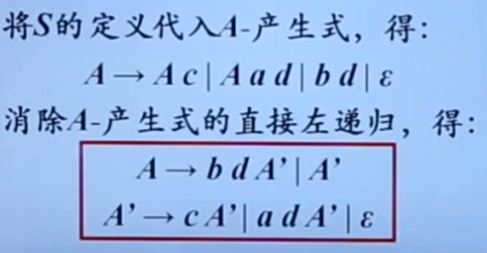
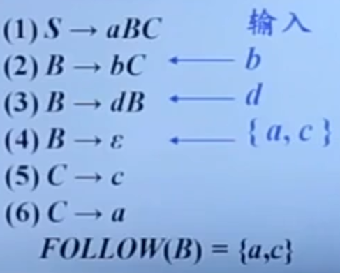
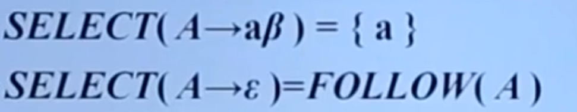

# 自顶向下分析概述

## 自顶向下的分析

从分析树的顶部（根节点）向底部（叶节点）方向构造分析树

可以看成是从文法开始符号 S 推导出词串 w 的过程

每一步推导中，都需要做两个选择：

1. 替换当前句型中的哪个非终结符
2. 用该非终结符的哪个候选式进行替换

<u>自顶向下的语法采用最左推导的方式</u>：

- 总是选择每个句型的*最左非终结符*进行替换
- 根据输入流的*下一个终结符*，选择最左非终结符的一个候选式

### 最左推导

在最左推导中，总是选择每个句型的**最左非终结符**进行替换

例：

最左推导是最右规约的逆过程

从文法用最左推导得到的句型称为当前文法的**最左句型**

### 最右推导

在最右推导中，总是选择每个句型的最右非终结符进行替换

在自底向上的分析中，总是采用最左归约的方式，因此把**最左归约**称为**规范规约**，而**最右推导**相应地称为**规范推导**

### 例子

## 自顶向下语法分析的通用形式

### 递归下降分析

由一组过程组成，每个过程对应一个非终结符

从文法开始符号 S 对应的过程开始，其中**递归调用**文法中其它非终结符对应的过程。如果 S 对应的过程体恰好扫描了整个输入串，则成功完成语法分析

可能需要**回溯**，导致效率较低

### 预测分析

预测分析是递归下降分析技术的一个特例，通过在输入中**向前看固定个数**（通常为 1）符号来选择正确的 A - 产生式

可以对某些文法构造出向前看 k 个输入符号的预测分析器，该类文法有时也称为 **LL(K) 文法类**

预测分析<u>不需要回溯</u>，是一种**确定**的自顶向下分析方法

## 文法转换

### 左递归

同一非终结符的多个候选式存在共同前缀，将导致回溯现象

含有 $A\rightarrow A\alpha$ 形式产生式的文法称为是**直接左递归**的

如果一个文法中有一个非终结符 A 使得对某个串 $\alpha$ 存在一个推导 $A\Rightarrow A^+\alpha$，那么这个文法就是**左递归**的

经过两步或两步以上推导产生的左递归称为是**间接左递归**的

左递归文法会使递归下降分析器陷入**无限循环**

### 消除直接左递归

也就是不能让非终结符在第一个位置

消除直接左递归是要付出代价的——引进了一些非终结符和空产生式

### 消除间接左递归

下图是间接左递归的产生式：

做法：

### 提取左公因子

通过改写产生式来推迟决定，等读入了足够多的输入，获得足够信息后再做出正确的选择

## LL(1) 文法

### 预测分析法的工作过程

从文法开始符号出发，在每一步推导过程中根据当前句型的最左非终结符 A 和当前输入符号 a，选择正确的 A- 产生式。为保证分析的确定性，选出的候选式必须是唯一的。

### S- 文法（简单的确定性文法）

每个产生式的右部都以**终结符**开始

同一非终结符的各个候选式的首非终结符都不同

### 非终结符的后继符号集

非终结符 A 的后继符号集：

可能在某个句型中紧跟在 A 后边的终结符 a 的集合，记为 $FOLLOW(A)$
$$
\text { FOLLOW }(A)=\left\{\mathrm{a} \mid S \Rightarrow \alpha^* A \mathrm{a} \beta, \mathrm{a} \in V_{T}, \quad \alpha, \beta \in\left(V_{T} \cup V_{N}\right)^{*}\right\}
$$
如果 A 是某个句型的最右符号，则将结束符 $ 添加到 FOLLOW(A) 中

例子： 

### 产生式的可选集

产生式 $A\rightarrow\beta$ 的可选集是指可以选用该产生式进行推导时对应的输入符号的集合，记为 $SELECT(A\rightarrow\beta)$

### q- 文法

每个产生式的右部或为 $\epsilon$，或以终结符开始，即不以非终结符开头

具有相同左部的产生式有不相交的可选集

### 串首终结符集

串首终结符：串首的第一个符号，并且是终结符。简称首终结符

给定一个文法符号串 $\alpha$，$\alpha$ 的**串首终结符集** $FIRST(\alpha)$ 被定义为可以从 $\alpha$ 推导出的所有串首终结符构成的集合。如果 $\alpha \Rightarrow \epsilon^*$，那么 $\epsilon$ 也在 $FIRST(\alpha)$ 中

### LL(1) 文法

#### 定义

第一个 L 表示**从左**向右扫描输入

第二个 L 表示产生**最左**推导

1 表示在每一步中只需要向前看**一个**输入符号来决定语法分析动作

#### 条件

文法 G 是 LL(1) 的，当且仅当 G 的任意两个具有相同左部的产生式 $A\rightarrow\alpha|\beta$ 满足下列条件：

- 如果 $\alpha$ 和 $\beta$ 均不能推导出 $\epsilon$，则 $FIRST(\alpha)\cap FOLLOW(\beta)=\Phi$
- $\alpha$ 和 $\beta$ 至多有一个能推导出 $\epsilon$ 
- 如果 $\beta \Rightarrow \epsilon^*$，则 $FIRST(\alpha)\cap FOLLOW(A)=\Phi$
- 如果 $\alpha \Rightarrow \epsilon^*$，则 $FIRST(\beta)\cap FOLLOW(A)=\Phi$

保证了同一非终结符的各个产生式的可选集互不相交